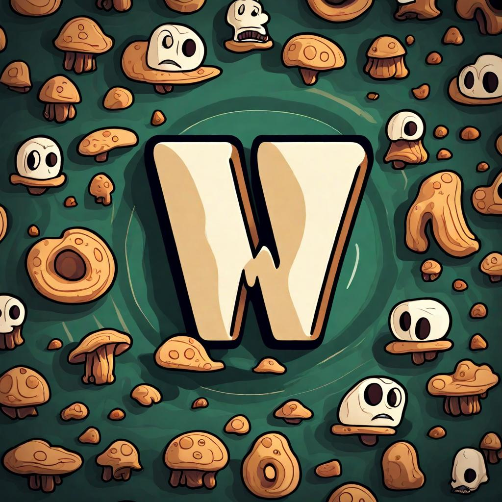

# Woody

Woody is my personal side project, a labor of love crafted entirely in pure Rust and powered by Vulkan.
It's a creative endeavor born out of passion, rather than an alternative to other well known engines.
With Woody, I explore the realms of game development,
experimenting and tinkering with Rust and Vulkan to create my own gaming experiences.
It's a journey of discovery and self-expression, and I'm excited to share my progress and learnings with you.



## Table of Contents

- [About](#about)
- [Features](#features)
- [Getting Started](#getting-started)
- [Usage](#usage)

## About

Woody is a personal side project born out of a passion for game development and a love for Rust and Vulkan.
It's not an ambitious endeavor aiming to be the next big thing; instead, it's a creative outlet where I explore the realms of game development on my terms.

## Features

- Vulkan rendering.
- Entity Component System (ECS) architecture.
- Cross-platform support (not yet).

## Getting Started

This section will guide you through the initial steps to set up and explore this game engine.

### Prerequisites

Before you begin, ensure you have the following prerequisites installed:

- [Rust](https://www.rust-lang.org/) - The programming language used for **Woody**.
- [Cargo](https://doc.rust-lang.org/cargo/) - The Rust package manager.
- [Vulkan](https://www.khronos.org/vulkan/) - The graphics API used by **Woody**.

### Installation

To get started, follow these simple steps:

1. Clone the **Woody** repository to your local machine:

```bash
git clone https://github.com/yourusername/woody.git
```

2. Navigate to the **woody** repository:

```bash
cd woody
```

3. Build the project.

```bash
cargo build --release
``


### Running the example

To ensure that everything is set up correctly, let's run a simple example:

```bash
cargo run --release
```

This will launch a simple demo application using Woody. You should see a window pop up with some basic graphics rendered.

## Usage

You can use this game engine in your own game if you want, just add it as dependency and you're ready to go.

### Documentation

For more detailed information on using Woody, refer to our documentation (coming soon, but you can use `cargo doc --no-deps --open`). It will provide insights into the engine's architecture, how to create scenes, work with assets, and much more.
